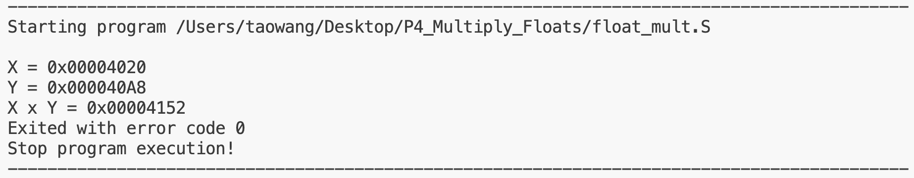
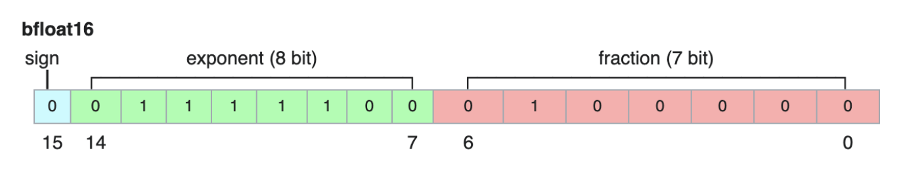
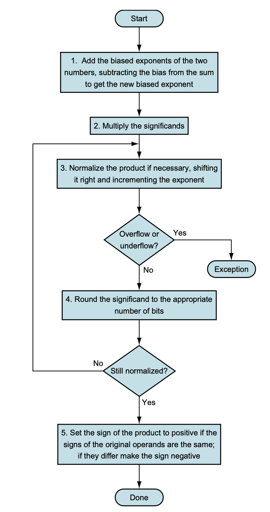

# Floating Point Multiplication

The float_mult.S contains a RISC-V program that multiplies two bfloat16 floating point numbers. However, the fraction bit of the float is 7 instead of 23.

## Skills Involved
* RISC-V Assembly Programming
* C Programming
* Binary Floating Point Multiplication

## Development Environment
This is part of a lab in the course, [EEC170](https://ece.ucdavis.edu/course-catalog), from UC Davis.
The program is written in RISC_V assembly language with the help of the [RISC-V Venus Simulator](https://marketplace.visualstudio.com/items?itemName=hm.riscv-venus) in Visual Studio Code.

## Algorithm
I mostly followed the algorithm from page 221 of [this book](https://www.amazon.com/Computer-Organization-Design-RISC-V-Architecture-dp-0128203315/dp/0128203315/ref=dp_ob_title_bk):

## Code Description
There's a C version of the same program, and I will reference the variable names from the main.c.
1. **Process X and Y's mantissas**
    * Give the mantissa its invisible bit by bit shifting 0x1 seven times and OR it with the mantissa.
    * Use a while loop to shift the mantissa to the right to take away its 0s after the decimal point.
    * The while loop also counts how many shift it has done, which we would use to calculate the decimal
    point for the mantissa as 7 - count.
2. **Perform Multiplication of Mantissas and Perform Normalization**
    * 7 - count1 + 7 - count2 = 14 - count1 - count2 is the decimal point of the product mantissa.
    * The key is that the result of mantissa multiplication is either 1.XXXXX or 10.XXXXX because
     of the invisible 1 being always in the front.
    * Use a variable e to check if the bit to the left of decimal point is 0 or 1.
    * If 1, no need to normalize, clear the bit to hide invisible 1.
    * If 0, normalize the MSB and shift the mantissa to the right once and record exponent offset.
3. **Shift the Product Mantissa To Appropriate Position for float16**
    * if 7 - (14 - count1 - count2) > 0, this means the product mantissa has less decimal point than 
    the allotted 7 bits, so we shift it left by the difference.
    * Else, we do the opposite.
4. **Sign Bit**
    * Extract the sign bits of x and y.
5. **Exponent**
    * Extract the exponent and subtract 127 and add the offset.
6.  **Assemble**
    * Get the sign bit by XOR the two sign.
    * Assemble everything by OR.

## Time Complexity
* O(1), the while loop at most loops 7 times to clear the 0 bits.
## Space Complexity
* O(1), we always store float16

## What I Could Do Better?
* There's no need to use while loops to clear the trailing zeros after the decimal point. I could've directly multiply the two mantissas after adding the invisible bit. Their product will always be 15 to 16 bits, and I could start from there to retrieve the 7 bits of mantissas I need.

## Helpful Links
Use [float.exposed](https://float.exposed/b0x4020) to quickly convert binary floating point to decimal floating point and vice versa.
